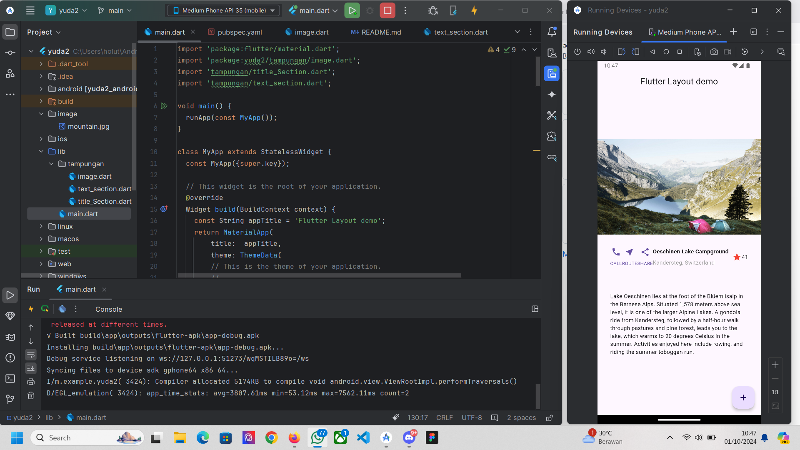
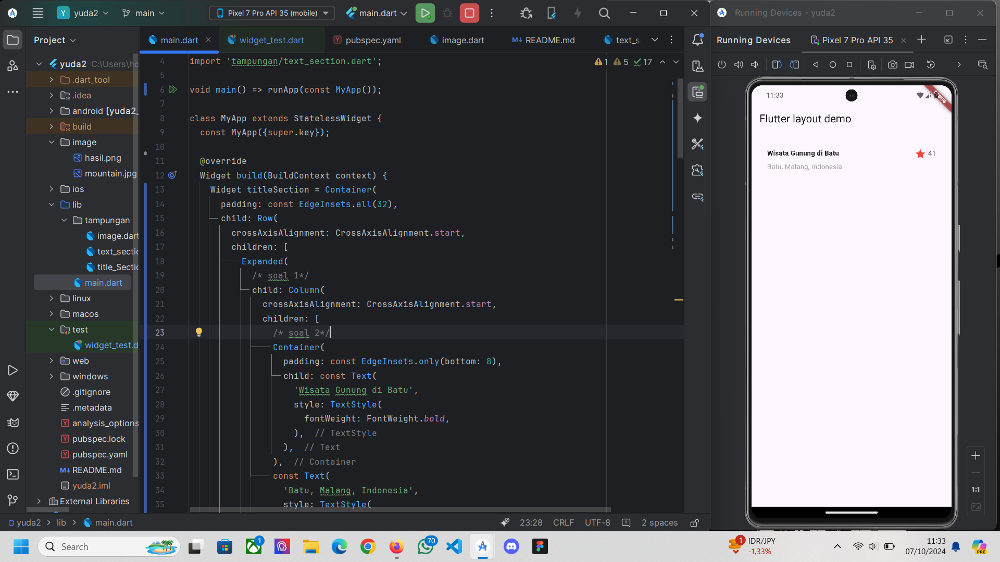
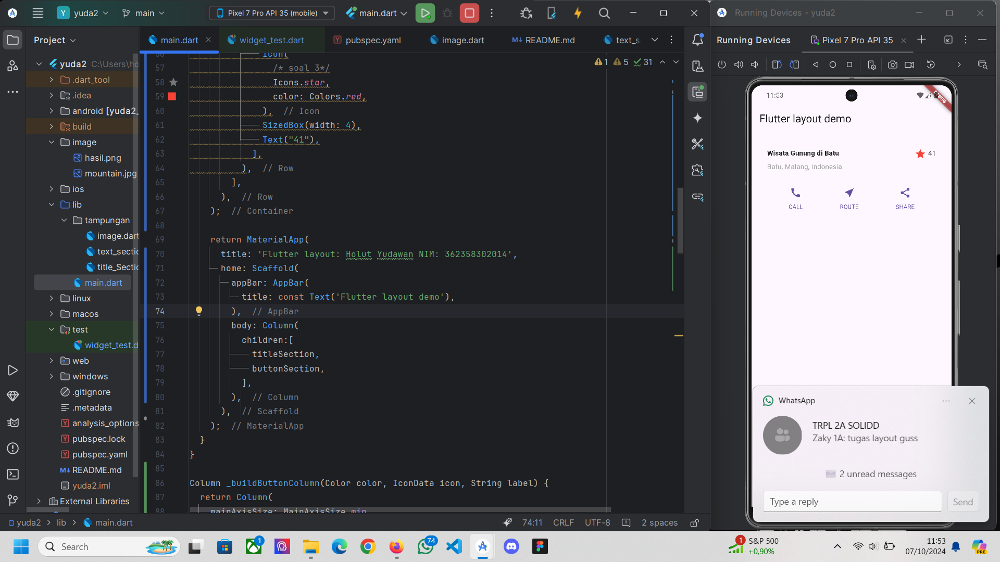
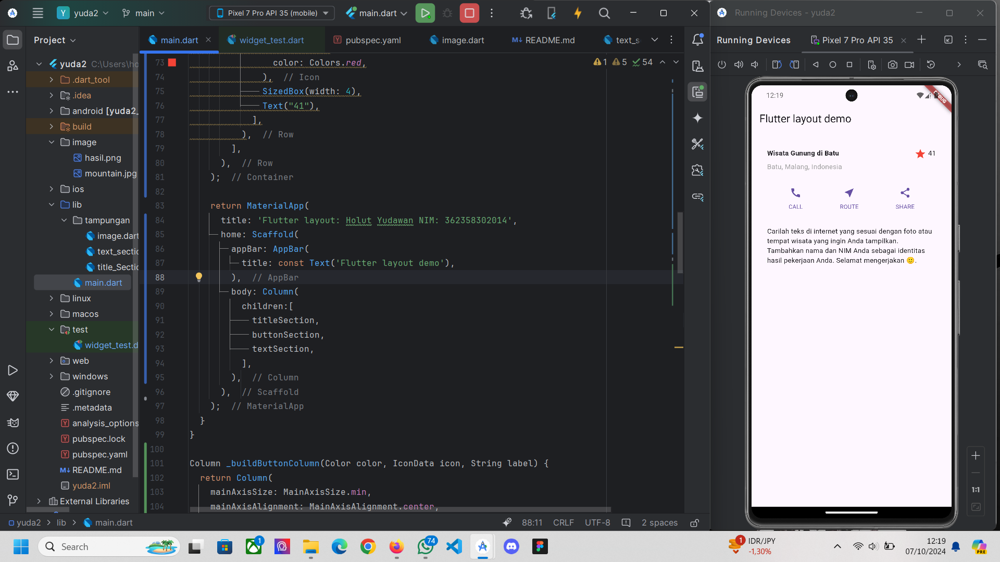
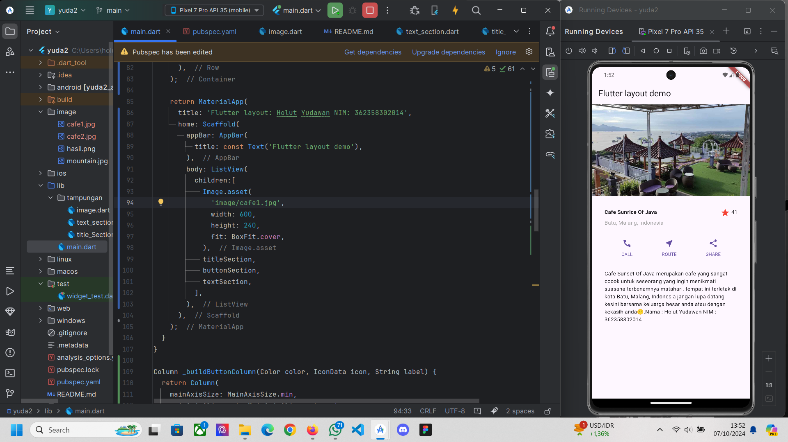

# yuda2

A new Flutter project.

hasil akhir

Widget Column diletakkan di dalam Expanded agar menyesuaikan ruang yang tersedia di Row.
Teks 'Cafe Sunrice Of Java' ditempatkan dalam Container dengan padding sebesar 8 piksel di bawahnya.
Teks 'Batu, Malang, Indonesia' diberi warna abu-abu.
Tambahkan ikon bintang berwarna merah dan teks "41",
semuanya ditempatkan dalam Container dengan padding sebesar 32 piksel di setiap tepi.

widget Row yang berisi tiga kolom, masing-masing dengan ikon dan teks.
Warna, ikon, dan teks ditentukan dengan memanggil fungsi _buildButtonColumn.
Masukkan variabel buttonSection ke dalam body di dalam metode build(), sehingga akan muncul di tampilan aplikasi.

textSection dibuat menggunakan Container dengan padding sebesar 32 piksel di setiap sisi.
Teks dimasukkan ke dalam Text widget dengan properti softWrap = true, sehingga teks akan membungkus secara otomatis sesuai lebar kolom.
Variabel textSection ditambahkan ke dalam body pada Scaffold sehingga teks tersebut akan ditampilkan bersama elemen lain di layout.

Buat folder images, tambahkan gambar, dan referensikan di pubspec.yaml
Gunakan Image.asset dengan BoxFit.cover dan ganti Column dengan ListView untuk mendukung scroll.

## Getting Started

This project is a starting point for a Flutter application.

A few resources to get you started if this is your first Flutter project:

- [Lab: Write your first Flutter app](https://docs.flutter.dev/get-started/codelab)
- [Cookbook: Useful Flutter samples](https://docs.flutter.dev/cookbook)

For help getting started with Flutter development, view the
[online documentation](https://docs.flutter.dev/), which offers tutorials,
samples, guidance on mobile development, and a full API reference.
